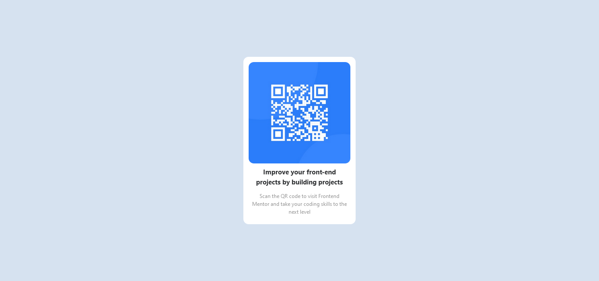

# Frontend Mentor - QR code component solution

This is a solution to the [QR code component challenge on Frontend Mentor](https://www.frontendmentor.io/challenges/qr-code-component-iux_sIO_H). Frontend Mentor challenges help you improve your coding skills by building realistic projects.

## Table of contents

- [Overview](#overview)
  - [Screenshot](#screenshot)
  - [Links](#links)
- [My process](#my-process)
  - [Built with](#built-with)
  - [Continued development](#continued-development)
  - [Useful resources](#useful-resources)
- [Author](#author)

## Overview

### Screenshot

### Links

- Solution URL: [Add solution URL here](https://your-solution-url.com)

## My process

### Built with

- Semantic HTML5 markup
- Tailwind css
- desktop-first workflow

### Continued development

want to study

- react js
- MEARN
- Java Spring Boot
- Next js
- tailwind css

### Useful resources

- [Tailwind css](https://tailwindcss.com/docs/installation) - This helped me for tailwind css. I really liked this pattern and will use it going forward.
- [Google](https://www.google.com) - searched the color code etc.

## Author

- Frontend Mentor - [@archana](https://www.frontendmentor.io/profile/Archanaub04)
- Twitter - [@yourusername](https://twitter.com/Archanaub24)
